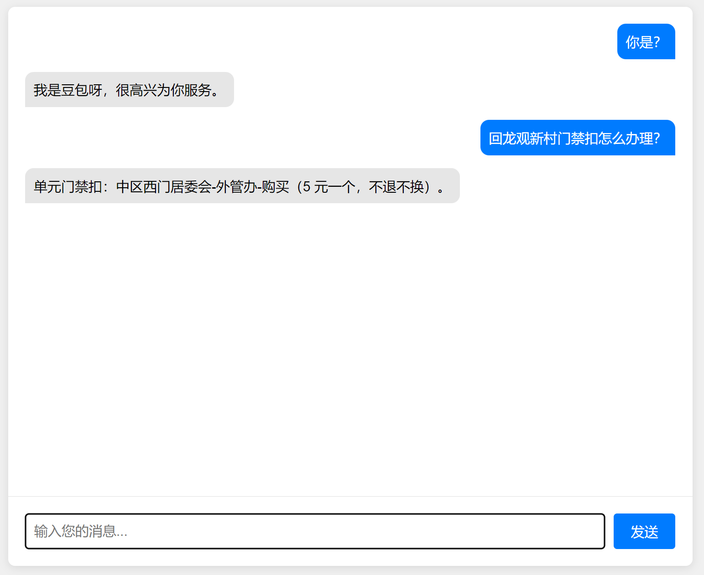

# coze_fastapi
coze的fastapi服务

### 项目起源
coze.cn的api特别难用，本地多轮对话极其不方便，所以开发了这个项目

### 使用指南
- 本项目适配coze_bot的api
- 运行本项目只需修改bot_id, 以及身份鉴权的token

### 安装环境

安装python

### 运行步骤
- 启动文件main.py

uvicorn main:app --reload --host 0.0.0.0 --port 5000

- 等待启动成功后，会出现网页地址，点击即可

INFO:     Uvicorn running on http://0.0.0.0:5000 (Press CTRL+C to quit)

- 效果展示

- 如果你还需要我帮助调整输出，请联系我

